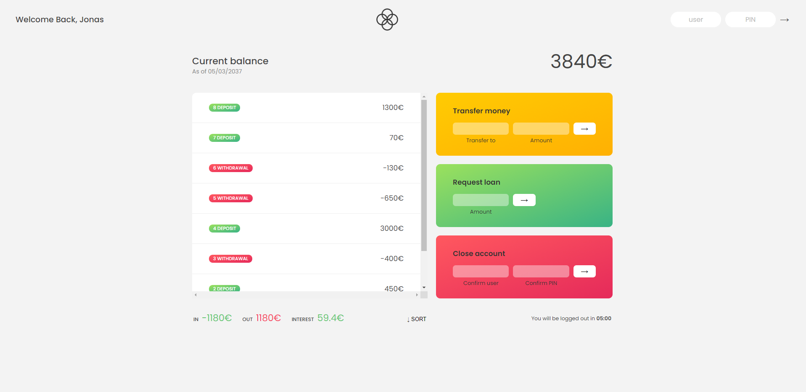

# Bankist App 

I coded this Bankist Website along with a tutor from my course in JavaScript. 
The theme perfectly fits the handling of array(-s/ -methods), such as the find-, push-, findIndex-, splice- and other methods and DOM manipulation.

They were needed to work with the account objects and their attributes (username, password, accountbalance etc.). 
The features of the website were the login, transfering and adding money and make it appear in the movements, deleting your account and a couple of other needed features.

users: js,   jd,   stw,  ss
PINS:  1111, 2222, 3333, 4444

